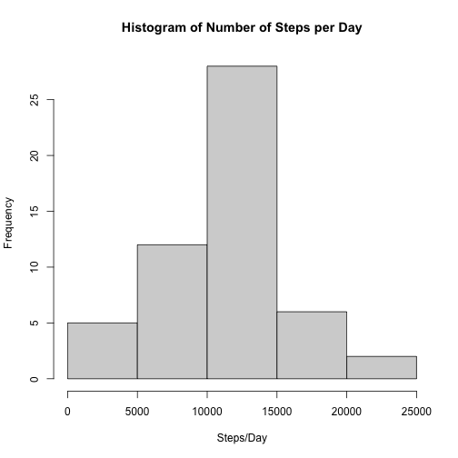
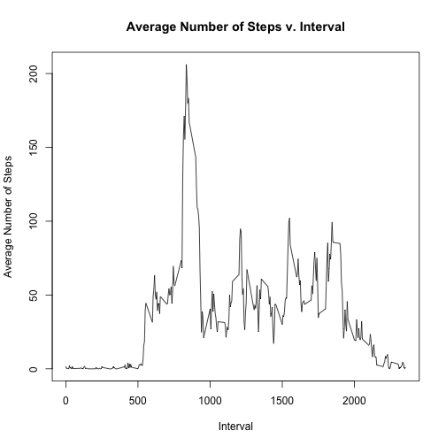
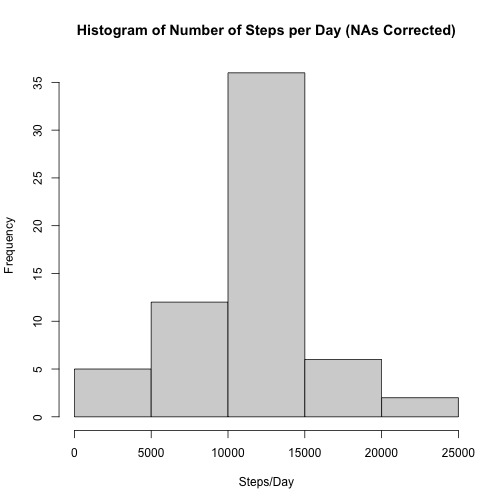
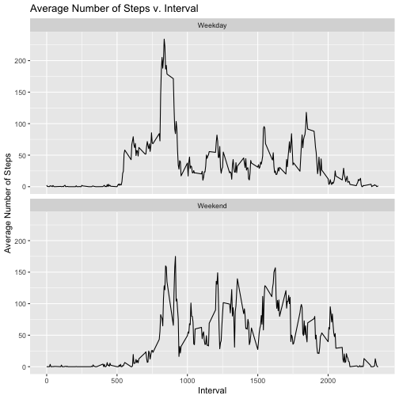

opts_chunk$set(echo = TRUE)

# Introduction
The following report documents my response to Course Project 1 of Coursera's Reproducible Research course taught by the John Hopkins University.

# What is mean total number of steps taken per day?
In order to respond to the question of total number of steps taken per day I read in the project data and then used the ddply function to group the steps by day and sum the data within each day. The code to perform those transformations and the histogram figure generated is below.


```r
# Step 1
library(plyr)
data  <- read.csv("activity.csv")
P1 <- ddply(data, "date", numcolwise(sum))
hist(P1$steps, main = "Histogram of Number of Steps per Day", xlab = "Steps/Day")
```



The mean and median of this data set is 1.0766189 &times; 10<sup>4</sup> and 10765, respectively.

# What is the average daily activity pattern?
To respond to the question of the average daily activity pattern I removed the NAs from the data set and then used the ddply function to group the steps by interval and take the mean of the data. The code to perform those transformations and the scatter plot generated is below.


```r
# Step 2
dataNA <- na.omit(data)
P2 <- ddply(dataNA, "interval", numcolwise(mean))
plot(P2$interval, P2$steps, type = "l", main = "Average Number of Steps v. Interval",
     xlab = "Interval", ylab = "Average Number of Steps")
```



The maximum in this data set occurs at interval 835.

# Inputing Missing Values
In the data set there are NAs. As a part of assigning values to those NAs I first verified that a NA was present and then assigned the NA the average steps for the interval in question. The code to perform these additions and the histogram figure generated is below.


```r
NAlog <- is.na(data$steps)
# Setting NA steps to average value of that interval
P3 <- data
for (i in 1:nrow(P3)) {
        if (is.na(P3[i,"steps"]) == TRUE) { # If NA
                Int <- P3[i,"interval"] # Grabbing interval of NA
                P3[i,"steps"] <- P2[which(P2$interval==Int),"steps"] # Assigning average value
        }
}
P3 <- ddply(P3, "date", numcolwise(sum))
hist(P3$steps, main = "Histogram of Number of Steps per Day (NAs Corrected)", xlab = "Steps/Day")
```



The total number of NAs replaced in the data set is 2304 and the mean and median of the data set is 1.0766189 &times; 10<sup>4</sup> and 1.0766189 &times; 10<sup>4</sup>, respectively. While the mean remained the same the median increased slightly. This is expected as in the original data set, the NAs were completely removed from the analysis; thus, the mean of the data wasn't impacted by the missing values. Assigning mean values to the data set resulted in further conformance of the data to the mean.

# Are there differences in activity patterns between weekdays and weekends?
In order to address the question of activity differences between weekdays and weekends I created a new column in the data set that converted the day of the week to either weekends or weekdays. I then performed a series of operations to average the steps per interval per factor and integrate the data sets for plotting. The code to perform these additions and the scatter plot generated is below.


```r
library(ggplot2)
P4 <- dataNA
P4 <- weekdays(as.Date(P4$date))
for (i in 1:length(P4)) {
        if (P4[i] == "Monday" | P4[i] == "Tuesday" | P4[i] == "Wednesday" | 
            P4[i] == "Thursday" | P4[i] == "Friday") {
                P4[i] <- "Weekday"
        } else { P4[i] <- "Weekend"}
}
P4 <- cbind(dataNA, P4)
P4_1 <- P4[which(P4$P4 == "Weekday"),]
P4_2 <- P4[which(P4$P4 == "Weekend"),]
P4_1 <- ddply(P4_1, "interval", numcolwise(mean))
P4_2 <- ddply(P4_2, "interval", numcolwise(mean))
P4_1$f <- "Weekday"
P4_2$f <- "Weekend"
P4 <- rbind(P4_1,P4_2)
P4[,"f"] <- as.factor(P4[,"f"])
p <- ggplot(P4, mapping = aes(x = interval, y = steps)) + geom_line()
p + facet_wrap(~f, nrow = 2) + labs(title = "Average Number of Steps v. Interval", x = "Interval", y = "Average Number of Steps")
```



